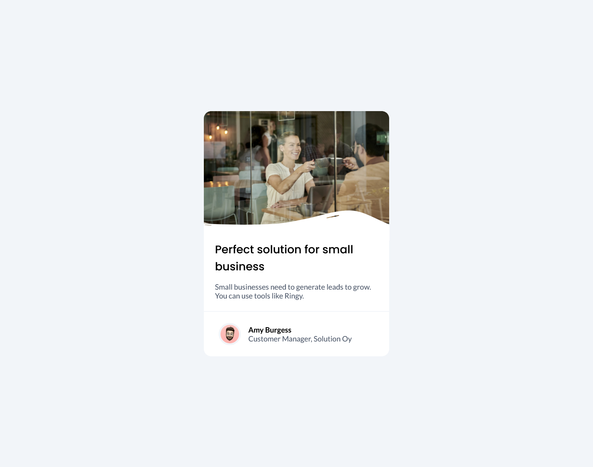

# business-blog-card

This is a small project I made to train with HTML, CSS and Flexbox.

## Table of Content

- [Overview](#overview)
  - [Description](#description)
  - [Screenshot](#screenshot)
  - [Links](#links)
- [My process](#my-process)
  - [Built with](#built-with)
  - [What I learned](#what-i-learned)
  - [Continued Development](#continued-development)
  - [Useful Resources](#useful-resources)
- [Author](#author)
- [Acknowledgments](#acknowledgments)

## Overview

### Description

I present to you a small project I made. The main objective was to work with HTML, CSS and Flexbox to perfect my knowledge with those technologies.
It consist of a simple business blog card containing a hero image in the header, a little description with a title in the main, and an author name, role and his avatar in the footer.
This project works on all device, from smartphone to desktop computer !

### Screenshot



### Links

- [Live Site](https://sephydev.github.io/business-blog-card/)

## My process

### Built with

- Semantic HTML5
- CSS
- Flexbox

### What I learned

Thanks to this project, I've practiced some semantic HTML, CSS and Flexbox. The following snippets are some examples of the knowledges I used.

- Semantic HTML5 (`<footer>`):

```html
<footer>
  
  <div>
    <p class="author">Amy Burgess</p>
    <p class="role">Customer Manager, Solution Oy</p>
  </div>
</footer>
```

- CSS (`footer img`):

```css
footer img {
  border-radius: 99rem;
  border: 0.25rem solid #f2f5f9;
  width: 3rem;
  margin-left: 2rem;
  margin-right: 1rem;
}
```

- Flexbox (`footer`):

```css
footer {
  display: flex;
  align-items: center;
  padding-top: 1.5rem;
  padding-bottom: 1.5rem;
}
```

### Continued Development

Seeing how Flexbox simplify webpage organization, I will continue to master these technologie.
I will do that by using those on other project, notably to make responsive website.

### Useful Resources

- [Guide to Flexbox (CSS Trick)](https://css-tricks.com/snippets/css/a-guide-to-flexbox/)

## Author

- Website : Sephydev

## Acknowledgment

Thanks to my friends and my family for supporting me while I journey in the land of Web Development, and during the making of this project !
